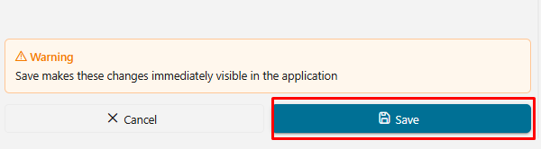
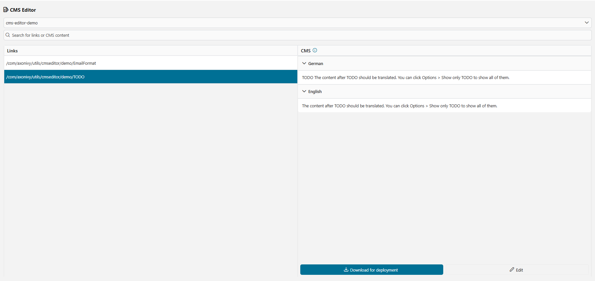

# CMS Editor
In AxonIvy, languages for UIs, notifications, or emails are managed within the CMS. We are excited to introduce the new CMS editor that significantly simplifies language editing! The key features are:

- User-friendly editor for translating new languages
- Edit an unlimited number of languages
- Simple styles available
- No HTML tags needed in the translation text

## Demo
### 1. CMS editor process start:
- Users should have the role of "CMS_ADMIN" to start the process.

### 2. CMS editor main page:

1. Project Selector: Each security context can contain multiple projects. First, choose the project you want to work on. The option "All" will be set as default when the user clicks start process for the first time.
   

2. Search Input: You can enter text to search by URI and project CMS. The search is case-insensitive.
   

3. Selected CMS: Displays the key of the selected content.
4. Edit button: Click to edit this CMS, and another column will be rendered for the user to edit the value for a specific language.
   
   
5. Save button:

   - When we hover to "Save" button , a warning message will be display to impress user

     
   - Change the CMS to application CMS, then mark an "Orange-dot" in the row of the CMS to notify users that this CMS has a different value in the application CMS compared to the project CMS.
   - In the header of the link column, display the red text "Reset all changes."
   - In the header of the CMS column, render the blue text "Undo Changes" to allow users to undo all changes for this project CMS (remove all values in the application CMS that belong to this project CMS).
   - The value of a specific language that the user edited will have a strikethrough for the project CMS sitting on the next newly edited value.
     
6. "Reset all changes" button: Display the confirm dialog and the user have to type "reset" word correctly , and button "Reset All" can be clickable. when users click it, all application cms that we updated from project CMS will be deleted
   
   
7. "Download for deployment" button: Downloads a zip file containing all translated contents.

- When we hover to "download" button , a warning message will be display to impress user
  

