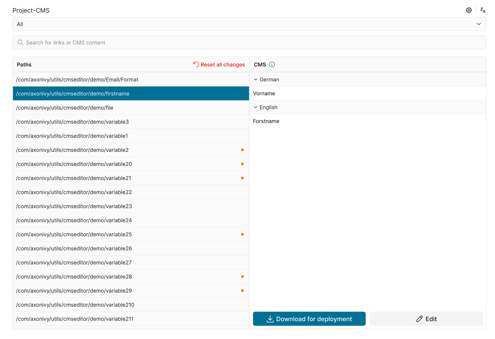
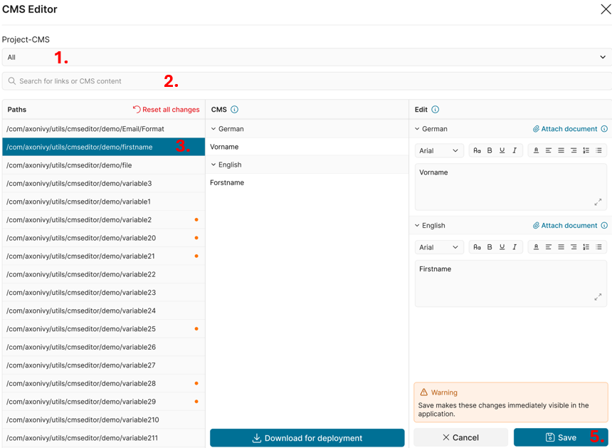
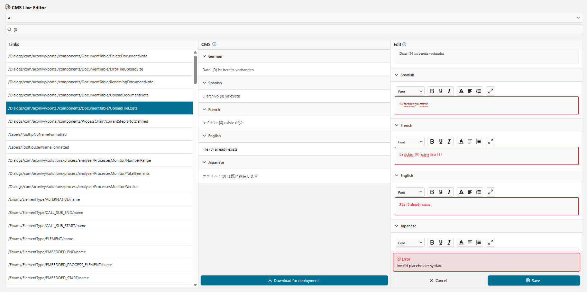
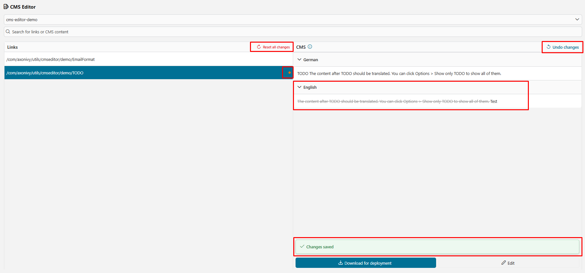
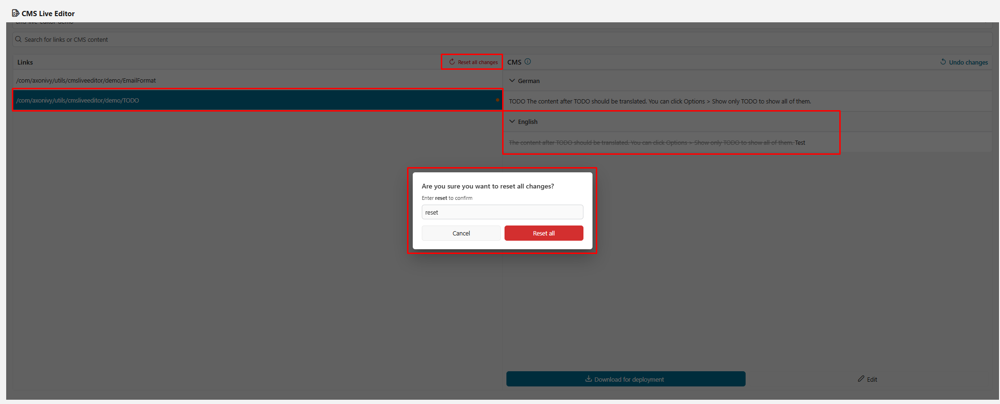
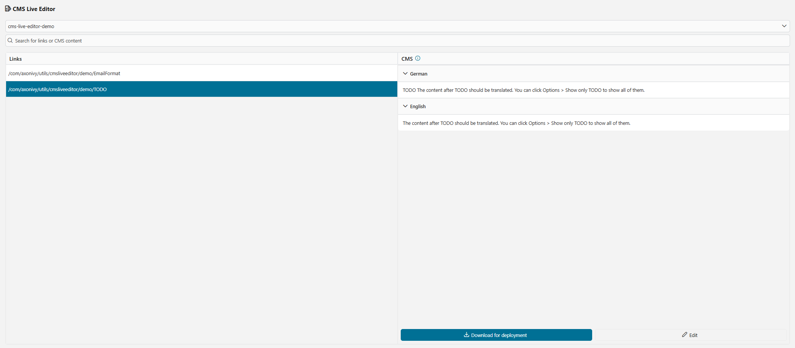
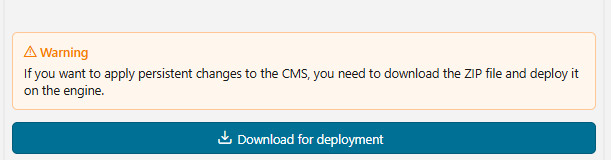

# CMS Live Editor
In Axon Ivy, languages for UIs, notifications, and emails are managed in the CMS (Content Management System). We are excited to introduce the new CMS Live Editor, which significantly simplifies language editing.

**Key features:**

- User-friendly editor for translating into new languages
- Support for an unlimited number of languages
- Simple styling options
- No HTML tags required in translation texts

## Demo
### 1. Install the CMS Live Editor
The CMS Live Editor must be installed in the same security context as the project content you want to edit.

### 2. CMS Live Editor process start:
The CMS Live Editor is now available as a process start in the dashboard. Users must have the role `CMS_ADMIN` to see and start the process.

### 3. CMS Live Editor main page:

1. Project Selector: Each security context can contain multiple projects. The option "All" will be set as default. Select a project if you want to view the content of a specific project only.
2. Search Input: You can enter text to search by URI or by content. The search is **case-insensitive**.
3. Selected CMS: Display the URI path of the selected content.
4. Edit button: Click to edit this CMS, and another column will be rendered for the user to edit the value for a specific language.
5. Save makes these changes immediately visible in the application

  

 ### 4. Validation
- When clicking **Save**, the editor validates **numbered placeholders** in the format `{0}`, `{1}`.
  - If **all locales** of the current CMS entry were edited, they must contain the same set of placeholders (order does not matter).
  - If **only specific locales** were edited, each edited locale must contain exactly the same placeholders as its original value.
- When placeholder validation fails:
   - Save is blocked, the affected editor(s) are highlighted, and an error message is shown: **Invalid placeholder syntax.**
   - You cannot switch to another CMS entry, use the search filter, or change the project. A popup appears **Some fields have not been saved yet** You must **Cancel** and correct your current edits to continue.
- Example: For the CMS entry *UploadFileExists*, the current edits must still contain `{0}`. Do not remove it, rename it (e.g., to `{1}`), remove the brackets, or add extra placeholders in some locales but not others.
   

- When a CMS value is modified in the application CMS, an "orange dot" indicator automatically appears in the corresponding row. This indicator notifies users that the application CMS value differs from the project CMS value.
- In the header of the Path column, the red text **Reset all changes** is displayed. This option allows users to restore all CMS values that have been modified and differ from the project CMS.
- In the header of the CMS column, the blue text **Undo Changes** is shown. This option allows users to undo all changes associated with the current project's CMS by removing all related values from the application CMS.
- The value of a specific language that the user edited will have a ~~strikethrough~~ for the project CMS value, followed by the newly edited value. This helps users clearly identify modified content.

  

  ### 5. Reset all changes
- After clicking **Reset all**, all CMS values in the application CMS that were updated from the project CMS will be permanently removed and restored to their original state.
- As this could be a disruptive activity,a confirmation dialog is displayed and the user must type the word *"reset"*  to enable the **Reset all** activity.

   
   

  ### 6. Download for deployment
- The **Download for deployment** button allows users to download a ZIP file containing all translated content.
- This can be used for a permanent engine deployment of the CMS values in the application.

  
