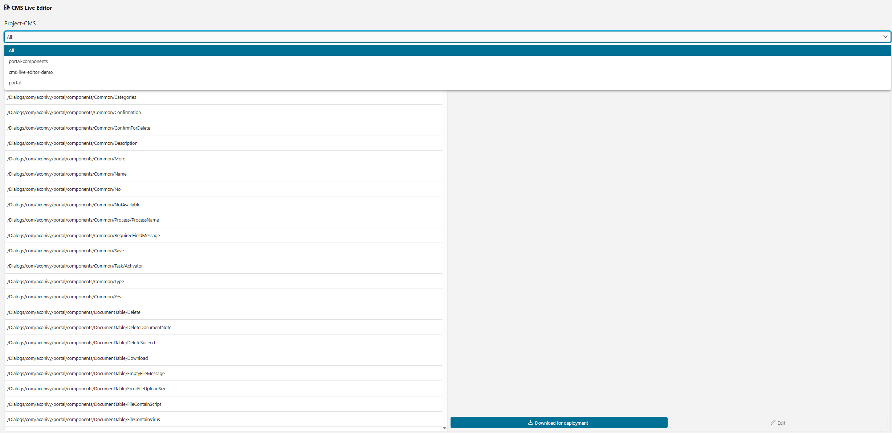
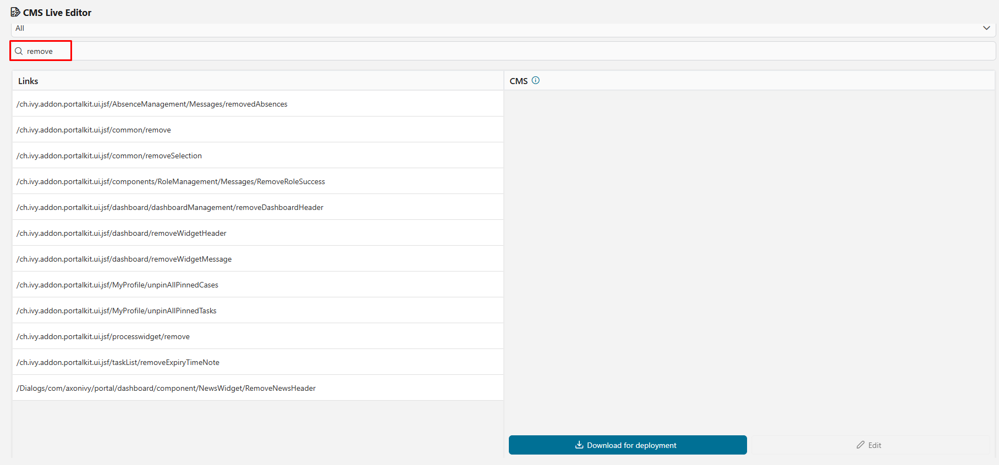
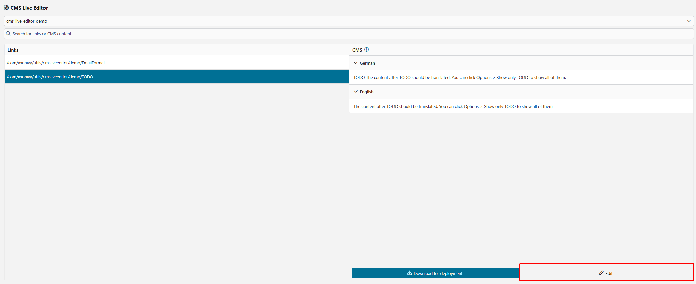
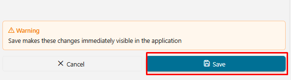

# CMS Live Editor
In AxonIvy, languages for UIs, notifications, or emails are managed within the CMS. We are excited to introduce the new CMS live editor that significantly simplifies language editing! The key features are:

- User-friendly editor for translating new languages
- Edit an unlimited number of languages
- Simple styles available
- No HTML tags needed in the translation text

## Demo
### 1. CMS live editor process start:
Users should have the role of "CMS_ADMIN" to start the process.

### 2. CMS live editor main page:

1. Project Selector: Each security context can contain multiple projects. First, choose the project you want to work on. The option "All" will be set as default when the user clicks start process for the first time.
   

2. Search Input: You can enter text to search by URI and project CMS. The search is case-insensitive.

   

3. Selected CMS: Display the URI path of the selected content.
4. Edit button: Click to edit this CMS, and another column will be rendered for the user to edit the value for a specific language.

   
   
5. Save button:
- When hovering over the **Save** button, a warning message is displayed to inform the user of potential changes.

  

- When clicking **Save**, the editor validates **numbered placeholders** in the format `{0}`, `{1}`, etc.
   - If **all locales** of the current CMS entry were edited, they must contain the same set of placeholders (order does not matter).
   - If **only specific locales** were edited, each edited locale must keep exactly the same placeholders as its original value.
- When placeholder validation fails:
   - The save is blocked, the affected editor(s) are highlighted, and an error message is shown: **Invalid placeholder syntax.**
   - You cannot switch to another CMS entry, use the search filter, or change the project. A popup appears **Some fields have not been saved yet** You must **Cancel** correct your current edits to continue.
- Example: For the CMS entry *UploadFileExists*, the current edits must still contain `{0}`. Do not remove it, rename it (e.g., to `{1}`), remove the brackets, or add extra placeholders in some locales but not others.
   

- When a CMS value is modified in the application CMS, an "orange dot" indicator automatically appears in the corresponding row. This indicator notifies users that the application CMS value differs from the project CMS value.
- In the header of the Path column, the red text **Reset all changes** is displayed. This option allows users to restore all CMS values that have been modified and differ from the project CMS.
- In the header of the CMS column, the blue text **Undo Changes** is shown. This option allows users to undo all changes associated with the current project's CMS by removing all related values from the application CMS.
- The value of a specific language that the user edited will have a ~~strikethrough~~ for the project CMS value, followed by the newly edited value. This helps users clearly identify modified content.

  
6. "Reset all changes" button:
- A confirmation dialog is displayed, and the user must type the word *"reset"* correctly to enable the **Reset all** button.
- After clicking **Reset all**, all CMS values in the application CMS that were updated from the project CMS will be permanently removed and restored to their original state.

   
   
7. "Download for deployment" button: Downloads a zip file containing all translated contents.
- The **Download for deployment** button allows users to download a ZIP file containing all translated content.
- When hovering over the button, a warning message is displayed to inform the user before downloading.

  